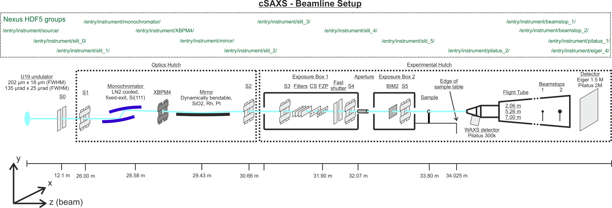

1. The setup of beamline

2. The principle of FZP

Fresnel Zone Plate

通过衍射来聚焦的“透镜”

它由一系列同心圆环（zone rings）组成，每一圈的宽度、位置都被精确计算，使得**各个环透过的光波在焦点处相干叠加、相位相同**，从而产生强烈的聚焦。

# Maximum-likelihood refinement for coherent diffraction imaging

# Iterative least-square solver for generalised maximum-likelihood ptychography

idea:

基于子域划分和pattern study 的ptychography method

很好，Zihan — 你的问题很关键。经过检索，我 **没有** 发现已有文献**完全**照你提出的“基于衍射 pattern 特征驱动区域划分 + 分块重建 + 多层（multislice）ptychography”这个完整框架来做，不过确实有相关的、部分重叠的研究方向。下面我整理一下 **已有工作**、**与你提案的差距**，以及 **潜在空白点**，方便你判断可投稿的新颖性。

------

## ✅ 已有相关工作

1. Overlapping Domain Decomposition Methods for Ptychographic Imaging（2020）
   - 提出了 “domain decomposition（子域分解）”方法，用于传统（single‐slice）ptychography，将整个样本分成子域，子域间有重叠，借此并行化优化。 ([arXiv](https://arxiv.org/abs/2011.00162?utm_source=chatgpt.com))
   - 虽然不是专门为 multislice，也不是基于衍射 “pattern 特征” 来自动划分子域。
   - 所以与“你想的 pattern‐driven划分 + multislice”有差别。
2. 文章如 Methodology for Robust Multislice Ptychography（2024）探讨了 multislice ptychography 的“物理与实验参数”选择问题（例如 oversampling、探针移动步长、Ronchigram 放大率）。 ([OUP Academic](https://academic.oup.com/mam/article/30/4/703/7693793?utm_source=chatgpt.com))
   - 虽然跟 multislice 相关，但没有侧重“pattern study”来驱动划分或重建加速。
3. 也有数据驱动优先项（prior）和机器学习方法用于 multislice ptychography：比如 Enhancing Depth Resolution of Multislice Ptychography with Data‑Driven Prior and Regularization（2024）使用 ML 模型改善深度分辨率。 ([OUP Academic](https://academic.oup.com/mam/article/30/Supplement_1/ozae044.942/7720150?utm_source=chatgpt.com))
   - 虽然这是 pattern/数据驱动的方向，但焦点在“增强深度分辨率”，而不是“基于 pattern 特征划分子域 + 加速重建”。

------

## ⚠️ 你的提案与现有工作的差距

- **子域划分是你用 “衍射图样相似性 / pattern 差异” 来驱动**，而不是仅仅“空间子域”或“网格子域”划分。
- **重建场景是 multislice（3D／厚样品）**，而不是仅单片或二维。
- **目标是加速 +减少计算开销**：通过 pattern 驱动来决定子域大小、迭代次数、甚至传播距离变化。
- 虽然 “domain decomposition” 和 “multislice” 各自已有研究，但“结合 pattern 分析 + multislice +加速”这个组合目前似乎未被系统系统地报道。

------

## 🎯 潜在新颖空白点／投稿亮点

- “Pattern similarity → 自动子域划分” 这个方法若你能证明有效，则为一个新的预处理阶段。
- 在 multislice重建流程中，依据 pattern 变化速率改变传播距离（你之前提到 “adaptive-z”）是一个鲜见的方向（尤其与子域划分结合）。
- 若你能给出 **算法框图 + 实验／模拟验证（例如不同 pattern group 的重建时间／精度对比）**，那将具有较强贡献。

------

如果你愿意，我可以帮你检索 **近五年（2020-2025）** 在 ptychography／4D-STEM 领域中有没有 **“pattern clustering／pattern embedding用于子域划分”** 的具体论文（你担心可能有人做过但你没查到）。要我帮你查吗？

