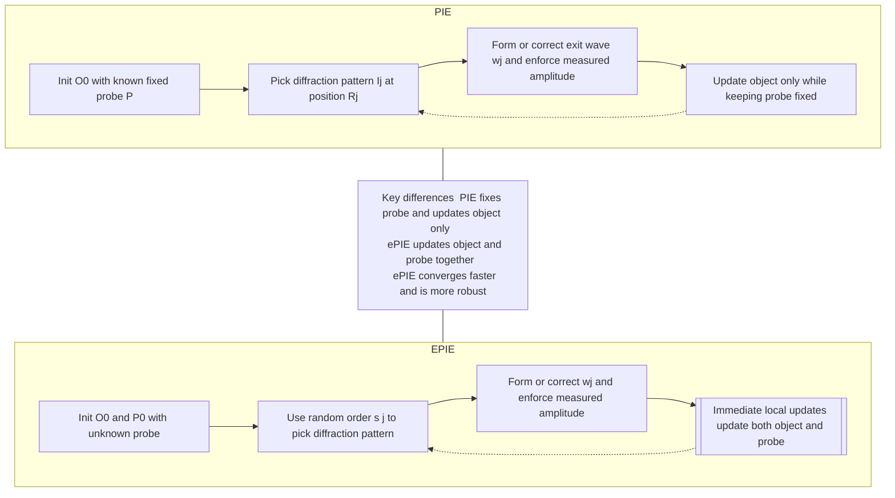

```mermaid
graph TD
  %% ----- PIE -----
  subgraph PIE
    P1[Init O0 with known fixed probe P]
    P2[Pick diffraction pattern Ij at position Rj]
    P3[Form or correct exit wave wj and enforce measured amplitude]
    P4[Update object only while keeping probe fixed]
    P1 --> P2
    P2 --> P3
    P3 --> P4
    P4 -.-> P2
  end

  %% ----- ePIE -----
  subgraph EPIE
    E1[Init O0 and P0 with unknown probe]
    E2[Use random order s j to pick diffraction pattern]
    E3[Form or correct wj and enforce measured amplitude]
    E4[[Immediate local updates update both object and probe]]
    E1 --> E2
    E2 --> E3
    E3 --> E4
    E4 -.-> E2
  end

  %% ----- Differences -----
  D[Key differences  PIE fixes probe and updates object only  
  ePIE updates object and probe together  
  ePIE converges faster and is more robust]

  PIE --- D --- EPIE

```